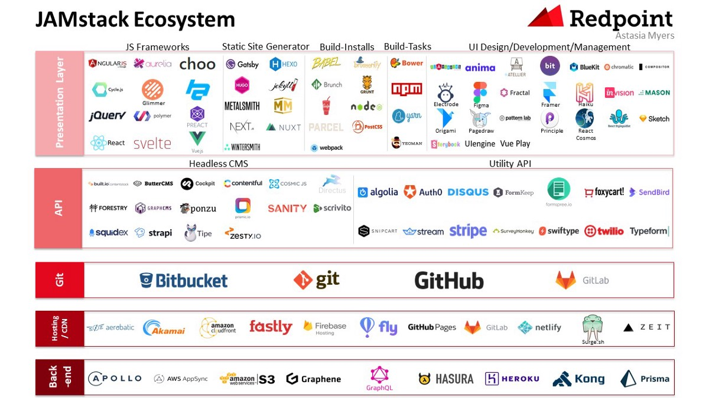

When we talk about “The Stack”, we no longer talk about operating systems, specific web servers, backend programming languages, or databases.

## What is the Jamstack?

You may have already seen or worked on a Jamstack site! They do not have to include all attributes of JavaScript, APIs, and Markup. They might be built using sites built by hand, or with Jekyll, Hugo, Nuxt, Next, Gatsby, or [another](https://www.staticgen.com/).

> The Jamstack is not about specific technologies.
> It’s a new way of building websites and apps that delivers better performance, higher security, lower cost of scaling, and a better developer experience.
> The thing that they all have in common is that they don’t depend on a web server.
> Pre-rendered sites can be enhanced with JavaScript and the growing capabilities of browsers and services available via APIs.

